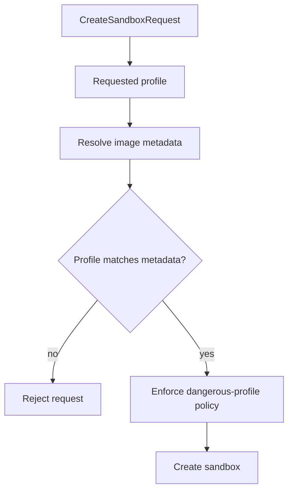

# Design

## Overview

The repo already has the right starting point for image slimming:
- `internal/model` already defines `GuestProfile`
- `internal/service` already validates image contracts for QEMU-backed images
- Docker still defaults to a broad image reference in config

The smallest repo-aligned design is to standardize on one curated profile vocabulary across both runtimes and to make image metadata cheap to validate.

For QEMU-backed images, keep using the existing guest-image contract path.
For Docker images, use curated image references plus lightweight OCI labels or sidecar metadata so the service can validate profile/capability claims before create.

## Affected areas

- `internal/config/config.go`
  - change default image posture away from a browser-heavy image
- `internal/model/model.go`
  - reuse `GuestProfile` and existing feature/capability fields
- `internal/service/service.go`
  - validate requested profiles against curated image metadata for Docker and QEMU paths
- `internal/service/policy.go`
  - block dangerous profiles by default in production
- `internal/runtime/docker/runtime.go`
  - optionally inspect image labels or validate curated image references before create
- `internal/presets/manifest.go`
  - let presets request explicit profiles cleanly
- `examples/*/preset.yaml`
  - align each example to the smallest required profile
- `images/base/Dockerfile`
  - split the current broad Docker image into smaller variants or a simple multi-stage family
- `images/guest/*`
  - keep the existing QEMU profile system aligned with the same profile names
- `docs/configuration.md`
  - document curated default images and allowed-image policy
- `docs/usage.md`
  - explain profile choice in sandbox creation flows

## Control flow / architecture

The control plane should validate image/profile compatibility before runtime create.



### Curated profile model

Use one small profile family:
- `core`
  - shell, core utils, workspace support, minimal runtime substrate
- `runtime`
  - `core` plus common language/runtime tools the product wants by default
- `browser`
  - browser automation stack only when explicitly requested
- `container`
  - inner Docker compatibility mode only when explicitly requested
- `debug`
  - troubleshooting image, non-default and blocked in production by default

### Docker image metadata

To keep the solution lightweight, prefer OCI labels instead of a new registry database.

Suggested labels:
- `org.or3.profile=core|runtime|browser|container|debug`
- `org.or3.capabilities=browser,inner-docker,...`
- `org.or3.dangerous=true|false`

The service or Docker runtime can inspect these labels once at create time and cache the result in memory for the process lifetime if needed.

### QEMU image alignment

QEMU already has guest-image contract support. The plan should align Docker images to the same profile semantics rather than duplicating logic.

This keeps policy simple:
- same profile names
- same dangerous-profile decisions
- different metadata loaders under the hood

### Default-image change

The config default should move away from:
- Playwright-heavy default image for all sandboxes

toward:
- minimal `core` or `runtime` image by default
- explicit browser example/preset references for browser use cases

## Data and persistence

### SQLite changes

No schema change is required because `sandboxes.profile`, `feature_set`, and `capability_set` already exist.

### Config and environment

Keep changes small:
- update `SANDBOX_BASE_IMAGE` default to a curated minimal image
- optionally add a small curated-image map or documented naming convention
- continue using `SANDBOX_POLICY_ALLOWED_IMAGES` to pin the allowed set

Avoid introducing a full image catalog service.

### Session and memory implications

None for sessions. Lower image weight should improve pull time, boot time, and density.

## Interfaces and types

No large new public type surface is needed.

Possible internal helper:

```go
type ImageMetadata struct {
    Ref          string
    Profile      model.GuestProfile
    Capabilities []string
    Dangerous    bool
}
```

For QEMU this can be populated from `internal/guestimage`; for Docker it can be populated from labels or a curated map.

## Failure modes and safeguards

- **profile/image mismatch**
  - reject create before runtime work begins
- **unpinned or drifting image ref**
  - docs and policy should steer production to pinned refs or local artifacts
- **missing Docker image labels**
  - allow only curated fallback mappings; do not guess broad capabilities
- **example drift**
  - update examples and presets so they do not quietly request heavyweight images
- **debug/container overuse**
  - dangerous-profile policy should block these by default in production

## Testing strategy

- config tests in `internal/config/config_test.go`
  - default image resolves to the smaller curated profile
- service tests in `internal/service/service_test.go`
  - create fails on profile mismatch and dangerous profile policy denial
- preset tests in `internal/presets/manifest_test.go`
  - examples request the smallest viable profile
- runtime tests in `internal/runtime/docker/runtime_test.go`
  - Docker image metadata inspection maps to the expected profile and capabilities
- integration tests in `internal/api/integration_test.go`
  - create requests surface profile validation errors cleanly
