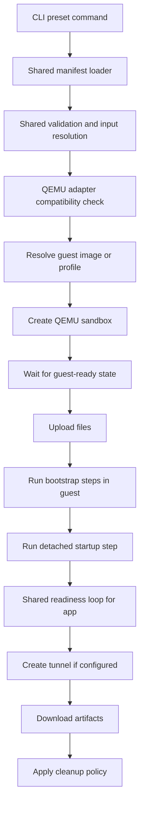

# QEMU Preset Parity Design

## Overview

The QEMU path should match the Docker preset feature surface without copying Docker's implementation details.

The central design rule is:

- **shared preset core for both runtimes**
- **runtime adapter for Docker vs QEMU differences**

QEMU differs from Docker mainly in packaging and readiness semantics:

- it boots a guest image instead of starting an arbitrary container image
- guest boot readiness and application readiness are separate concerns
- some examples may need prebuilt guest images or guest profiles instead of direct image references

That means QEMU should share the preset runner and manifest contract, but use a different compatibility and packaging layer.

## Affected areas

- `internal/presets` (shared)
  - Same manifest schema and validation entry point as Docker.

- `cmd/sandboxctl` (shared)
  - Same preset subcommands and shared orchestration engine.

- `internal/presets/qemu` or equivalent adapter layer
  - QEMU compatibility checks
  - guest-image/profile resolution
  - guest/app readiness interpretation

- [internal/runtime/qemu/runtime.go](internal/runtime/qemu/runtime.go)
  - Likely no major orchestration changes.
  - May need small helper visibility improvements if the runner needs clearer guest/application readiness boundaries.

- [internal/model/model.go](internal/model/model.go), [internal/api/router.go](internal/api/router.go), [internal/service/service.go](internal/service/service.go)
  - Shared binary-safe file transfer work reused from the Docker track.

- `examples/`
  - QEMU-oriented manifests and documentation that reference compatible guest images or profiles.

## Control flow / architecture

The QEMU plan should reuse the same shared runner flow as Docker, with a QEMU adapter providing compatibility and packaging decisions.



### Shared-core boundary

The following must stay shared with Docker:

- manifest parsing
- env resolution
- file upload sequencing
- command step sequencing
- cleanup policy
- artifact download handling
- user-facing CLI commands

The following may be QEMU-specific:

- image/profile resolution
- guest capability checks
- guest boot vs app readiness staging
- docs for preparing example-ready guest images

## Data and persistence

### SQLite

No SQLite migration is required for the QEMU preset phase.

### Guest image or profile model

The first-pass QEMU path likely needs a notion of **preset-compatible guest profiles** documented at the preset layer, for example:

- base guest with Python only
- base guest with Python + Bun/Node
- base guest with browser tooling

This does **not** need to be a new database feature. It can start as repo-local manifest metadata plus documented operator prerequisites.

### Binary transfers

QEMU should reuse the same binary-safe file transfer support added for Docker.

## Interfaces and types

### Shared manifest with runtime hints

A shared manifest can include runtime selection hints without forking the schema.

Example:

```go
type RuntimeSelector struct {
    Allowed []string
    Profile string
}
```

Or alternatively:

```yaml
runtime:
  allowed: [qemu]
  profile: python-bun-guest
```

This keeps the schema shared while allowing QEMU-specific compatibility rules.

### QEMU capability adapter

A QEMU adapter can expose information such as:

```go
type RuntimeCapabilities struct {
    Name                    string
    SupportsArbitraryImages bool
    SupportsDetachedExec    bool
    SupportsTunnels         bool
    SupportsBinaryArtifacts bool
    RequiresGuestProfile    bool
}
```

Expected QEMU interpretation:

- arbitrary images: no, not in the same sense as Docker
- detached exec: yes, via current runtime/service flow
- tunnels: yes
- binary artifacts: yes, after shared file API work
- guest profile requirement: yes for many presets

## Failure modes and safeguards

### Incompatible preset packaging

- Fail before sandbox creation if a preset assumes arbitrary container images that the QEMU path cannot honor.
- Recommend the required guest profile or compatible base image.

### Guest boot failure

- Report as a guest/runtime failure, not a preset bootstrap failure.
- Surface serial/boot diagnostics when available.

### Guest ready but app not ready

- Treat this as a preset startup or readiness failure.
- Keep the sandbox for inspection when cleanup policy says so.

### Artifact retrieval issues

- Reuse shared binary artifact logic.
- Distinguish transfer failures from guest application failures.

### Feature drift from Docker

- Prevent divergence by keeping step orchestration and manifest behavior in shared code.
- Only packaging, capability checks, and readiness interpretation should differ.

## Testing strategy

### Shared tests

- Shared manifest and runner tests should run once and apply to both runtimes where possible.

### QEMU-specific unit tests

- compatibility validation for guest profiles
- guest-ready vs app-ready stage handling
- early failure for incompatible Docker-style image assumptions

### QEMU integration tests

- one guest bootstrap/tooling example
- one guest service/tunnel example if the guest profile supports it
- one artifact-download example only after a compatible guest/browser profile exists

### Test discipline

Do not duplicate Docker runner tests just to assert the same shared orchestration behavior. Only add QEMU-specific tests for QEMU-specific behavior.

## QEMU-specific notes

- QEMU parity should be feature parity, not implementation parity.
- Some example presets may need a guest-profile catalog or prebuilt example-ready guest images.
- That difference is acceptable as long as the user-facing preset contract stays aligned with the Docker track.
