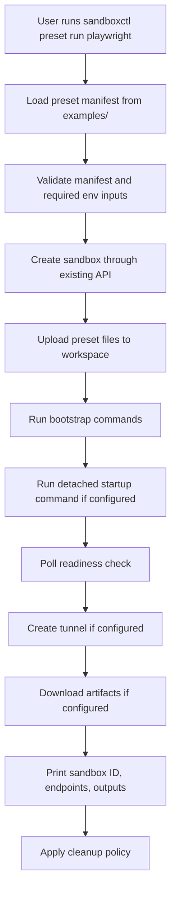

# OpenSandbox-Style Example Presets Design

> Superseded for implementation planning by:
>
> - [planning/opensandbox-example-presets-docker/design.md](planning/opensandbox-example-presets-docker/design.md)
> - [planning/opensandbox-example-presets-qemu/design.md](planning/opensandbox-example-presets-qemu/design.md)
>
> Keep this document as the original combined concept, but use the split Docker/QEMU plans for execution so both runtimes target the same feature set through shared code.

## Overview

OpenSandbox's examples are SDK-driven scripts that create a sandbox, inject env vars, run setup commands, launch a workload, wait for readiness, expose an endpoint, and optionally download artifacts.

`or3-sandbox` can support the same *user outcome*, but the architecture should be different:

- keep `sandboxd` focused on sandbox lifecycle, file APIs, exec, tunnels, and storage
- add a **CLI-side preset runner** in `sandboxctl`
- use **repo-local manifest files** for example definitions
- add only the minimum server/API changes needed to support those examples cleanly, especially **binary-safe file download**

This fits the current architecture because the repository is already CLI-first, single-node, and centered on explicit sandbox lifecycle calls instead of a rich external SDK.

## Affected areas

- [cmd/sandboxctl/main.go](cmd/sandboxctl/main.go)
  - Add `preset` or `example` subcommands such as `list`, `inspect`, and `run`.
  - Add progress reporting and cleanup policy flags.

- `internal/presets` (new package)
  - Load, validate, and normalize preset manifests from repo-local files.
  - Resolve repo-local assets to upload or inline into the sandbox workspace.

- [internal/model/model.go](internal/model/model.go)
  - Extend file read/write request/response models only as needed for binary-safe transfers.
  - Keep existing JSON shapes backward compatible.

- [internal/api/router.go](internal/api/router.go)
  - Add or extend file transfer endpoints for binary-safe download/upload behavior.
  - Avoid introducing a daemon-side preset orchestration API unless clearly necessary.

- [internal/service/service.go](internal/service/service.go)
  - Reuse existing create/exec/file/tunnel flows.
  - Add binary-safe file read/write support if implemented at the service layer.

- [internal/runtime/docker/runtime.go](internal/runtime/docker/runtime.go)
  - Likely unchanged for preset orchestration itself.
  - Existing detached exec support is sufficient for gateway/service startup.

- [docs/](docs/)
  - Add preset runner documentation and example-specific READMEs.

- `examples/` (new top-level directory)
  - Add manifests, sample assets, and README files for shipped presets.

## Control flow / architecture

The preferred design is a **client-side orchestration flow**.



### Why CLI-side orchestration is the right fit

OpenSandbox examples call SDK methods directly. In this repository, the closest equivalent is `sandboxctl` orchestrating the existing HTTP API.

This approach avoids:

- a new daemon-side workflow engine
- a new SQLite table for example jobs
- long-running orchestration state inside `sandboxd`
- server-side coupling to repo-local example assets

### Why not mirror OpenSandbox exactly

OpenSandbox can pass richer create-time options such as metadata, entrypoint, and network policy directly through its SDK. `or3-sandbox` does not have that object model today.

For this repo, the smallest viable parity is:

- create a sandbox with current create fields
- use file uploads to seed workspace content
- use exec to install or configure tools
- use detached exec to start services
- use tunnel APIs for exposed endpoints
- use file download APIs for artifacts

That delivers the same practical examples without forcing the server into a different architecture.

## Data and persistence

### SQLite

No SQLite schema change is required for the first pass.

Rationale:

- Preset definitions live in repo files, not in the database.
- Preset execution can reuse existing audit and sandbox/execution records.
- The daemon already persists sandboxes, execs, snapshots, and tunnels.

If future work needs historical preset-run reporting, that should be a separate, explicit follow-up and not part of the initial preset feature.

### Config and env

No new daemon config is required for the core preset runner.

Potential CLI-side env conventions:

- `SANDBOX_API`
- `SANDBOX_TOKEN`
- preset-specific envs such as `ANTHROPIC_AUTH_TOKEN`, `TARGET_URL`, `OPENCLAW_GATEWAY_TOKEN`

Optional later enhancement:

- allow `sandboxctl preset run --env KEY=VALUE`
- allow `sandboxctl preset run --set image=...`

### Session and memory implications

None. Preset runs are sandbox orchestration workflows and do not affect chat/session/memory behavior because this repository does not use the `or3-intern` memory stack described in the planning-agent base prompt.

## Interfaces and types

### Preset manifest

A lightweight YAML or JSON format is sufficient. YAML is likely easier for humans to maintain.

Example shape:

```go
type PresetManifest struct {
    Name        string
    Description string
    Runtime     string
    Sandbox     SandboxPreset
    Inputs      []PresetInput
    Files       []PresetFile
    Bootstrap   []PresetStep
    Startup     *PresetStep
    Readiness   *ReadinessCheck
    Tunnel      *TunnelPreset
    Artifacts   []ArtifactSpec
    Cleanup     CleanupPolicy
}
```

Supporting types:

```go
type SandboxPreset struct {
    Image         string
    CPULimit      string
    MemoryMB      int
    PIDsLimit     int
    DiskMB        int
    NetworkMode   string
    AllowTunnels  bool
    Start         bool
}

type PresetInput struct {
    Name        string
    Required    bool
    Secret      bool
    Description string
    Default     string
}

type PresetStep struct {
    Name            string
    Command         []string
    Env             map[string]string
    Timeout         time.Duration
    Detached        bool
    ContinueOnError bool
}

type ReadinessCheck struct {
    Type           string
    Command        []string
    Path           string
    Port           int
    ExpectedStatus int
    Timeout        time.Duration
    Interval       time.Duration
}

type TunnelPreset struct {
    Port       int
    Protocol   string
    AuthMode   string
    Visibility string
}

type ArtifactSpec struct {
    RemotePath string
    LocalPath  string
    Binary     bool
}
```

### CLI runner surface

A repo-native command set could look like:

```text
sandboxctl preset list
sandboxctl preset inspect <name>
sandboxctl preset run <name> [--keep] [--cleanup=always|never|on-success] [--set key=value] [--env KEY=VALUE]
```

### Binary file transfer

Current file reads return UTF-8 text content only. That is not sufficient for screenshots or other binary artifacts.

A backward-compatible approach is to add an optional transfer mode:

```go
type FileReadResponse struct {
    Path          string `json:"path"`
    Content       string `json:"content,omitempty"`
    ContentBase64 string `json:"content_base64,omitempty"`
    Size          int64  `json:"size"`
    Encoding      string `json:"encoding"`
}
```

Suggested rules:

- default text mode remains unchanged
- `encoding=base64` or a dedicated binary endpoint returns base64 content
- CLI decodes to local bytes when downloading artifacts

## Failure modes and safeguards

### Invalid manifest

- Fail before sandbox creation.
- Report missing fields, invalid durations, unsupported readiness types, or Docker-only presets being used with incompatible assumptions.

### Missing required secrets

- Fail before bootstrap.
- Never print secret values in error messages or logs.

### Bootstrap or startup command failure

- Mark the preset run as failed.
- Print the failing step name and bounded stdout/stderr preview.
- Respect cleanup policy so users can inspect the sandbox when needed.

### Readiness timeout

- Return the sandbox ID and any partial startup info.
- Do not claim success if the readiness probe never passes.

### Binary artifact corruption

- Add regression coverage for binary-safe transfer.
- Do not reuse UTF-8-only read paths for screenshots.

### Policy denial

- Surface current policy errors directly.
- Example docs must explain that operator policy may block public tunnels, images, or lifecycle actions.

### Runtime mismatch

- Docker-focused presets should fail early with a clear message when the configured deployment path is incompatible with the preset assumptions.
- Do not silently degrade a container-image-based preset into the QEMU path.

## Testing strategy

Use Go's `testing` package throughout.

### Unit tests

- `internal/presets` manifest parse and validation tests
- placeholder/env expansion tests
- cleanup policy decision tests
- readiness loop behavior tests

### CLI tests

- extend `cmd/sandboxctl` tests for `preset list`, `preset inspect`, and `preset run`
- use a stub HTTP server to verify request sequencing
- ensure secrets are not printed in CLI output

### API/service tests

- add regression tests for binary-safe file download/upload behavior
- keep existing file API text behavior intact
- add tunnel/readiness-related API tests where new helper behavior is introduced

### Integration tests

- Docker-backed integration smoke for at least one shipped preset
- suggested targets:
  - CLI preset: install and run a coding CLI in a container with env injection
  - Playwright preset: generate and download a screenshot artifact
  - service/gateway preset: start a detached process and wait for tunnel readiness

### Scope discipline

Do not expand this phase into:

- a Python SDK for `or3-sandbox`
- generic network policy parity with OpenSandbox
- Kubernetes runtime parity
- daemon-side orchestration persistence
- a frontend preset gallery
