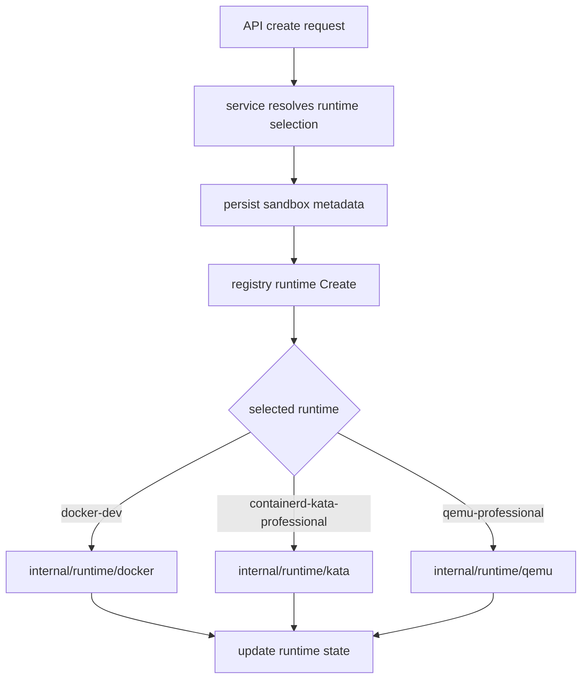

# Design

## Overview

The repo already has the correct high-level shape for a multi-runtime v1:

- `cmd/sandboxd` constructs one service and one runtime boundary
- `internal/service` owns lifecycle policy, quota, audit, snapshots, and reconciliation
- `internal/model.RuntimeManager` provides a shared runtime contract
- Docker and QEMU already implement that contract
- sandbox rows already persist `runtime_backend` and `runtime_class`

The main technical gap is that runtime choice is still effectively daemon-wide:

- `config.Config` carries a single `RuntimeBackend`
- `cmd/sandboxd/main.go` builds one runtime
- `service.Service` stamps new sandboxes from that daemon-wide backend
- reconciliation and operational endpoints assume one selected runtime for the process

The cleanest v1 approach is to keep the current layers and add a lightweight runtime registry/dispatcher inside the existing process.

That gives the project:

- one control plane
- multiple enabled runtimes
- explicit per-sandbox runtime selection
- no new scheduler or sidecar service
- minimal churn to API/service code because dispatch stays behind `model.RuntimeManager`

The design should also keep existing QEMU work in scope while adding Kata as a new VM-backed adapter.

## Affected areas

- `cmd/sandboxd/main.go`
  - replace single-backend runtime construction with registry construction and additive config validation
- `cmd/sandboxctl/main.go`
  - extend create/preset flows to send explicit runtime selection where requested
- `cmd/sandboxctl/doctor.go`
  - extend doctor output to report enabled/default runtimes and host prerequisites per runtime selection
- `internal/config/config.go`
  - add enabled/default runtime-selection config while preserving the existing single-backend env path for compatibility
- `internal/model/runtime.go`
  - add runtime-selection metadata to `SandboxSpec` so create dispatch is explicit
- `internal/model/model.go`
  - extend create request and runtime info models to expose explicit runtime selection
- `internal/model/runtime_class.go`
  - evolve runtime-selection helpers without losing the current VM-backed policy semantics
- `internal/runtime/registry` or equivalent new small package
  - add the runtime dispatcher that implements `model.RuntimeManager` and selects the concrete backend by sandbox metadata
- `internal/runtime/docker`
  - adapt to registry wiring and capability reporting, but keep Docker implementation localized
- `internal/runtime/qemu`
  - adapt to registry wiring and preserve existing lifecycle/snapshot behavior
- `internal/runtime/kata`
  - new adapter implementing the shared runtime contract with containerd + Kata
- `internal/service/service.go`
  - resolve runtime selection per sandbox, stamp metadata, and route snapshots/reconcile through persisted runtime selection
- `internal/service/policy.go`
  - enforce runtime enablement, production rules, image/template allowlists, and public exposure policy per runtime selection
- `internal/service/observability.go`
  - add runtime-selection counts and alerts where useful
- `internal/repository/store.go`
  - persist new selection/compatibility metadata and keep legacy-row fallback behavior deterministic
- `internal/db/db.go`
  - add additive migration(s) for explicit runtime selection on snapshots and any new compatibility fields needed
- `internal/api/router.go`
  - accept runtime selection in create requests and expand runtime-info output to show enabled/default selections
- `docs/runtimes.md`, `docs/architecture.md`, `docs/setup.md`, `docs/usage.md`
  - document trust boundaries, runtime tradeoffs, and runtime-selection behavior
- tests under `internal/config`, `internal/service`, `internal/repository`, `internal/api`, `internal/runtime/*`, and `cmd/sandboxctl`
  - add regression coverage for config, migration, selection, reconciliation, and unsupported-feature behavior

## Control flow / architecture

The design should keep `service.Service` depending on a single `model.RuntimeManager`, but that runtime becomes a dispatcher rather than a concrete backend.



### 1. Runtime selection model

The product-facing runtime selections should be explicit and stable:

- `docker-dev`
- `containerd-kata-professional`
- `qemu-professional`

Because the repo already uses `runtime_class` in a narrower VM-vs-trusted sense, the implementation should preserve compatibility by separating two concepts:

- **runtime selection key**: which adapter/config bundle to use for a sandbox
- **isolation posture**: whether the selected runtime is VM-backed or trusted/shared-kernel

A lightweight way to do this is:

```go
type RuntimeSelection string

const (
    RuntimeSelectionDockerDev                RuntimeSelection = "docker-dev"
    RuntimeSelectionContainerdKataProfessional RuntimeSelection = "containerd-kata-professional"
    RuntimeSelectionQEMUProfessional         RuntimeSelection = "qemu-professional"
)
```

And keep a derived policy helper similar to today:

```go
func (s RuntimeSelection) IsVMBacked() bool
func (s RuntimeSelection) Backend() string
```

If preserving the existing `runtime_class` column is less disruptive than redefining it, the store can keep the current isolation-class semantics and add one explicit selection column. The public API can still expose the operator-facing runtime selection requested in the v1 document.

### 2. Dispatcher instead of daemon-wide backend

Add a small registry runtime that implements `model.RuntimeManager`:

```go
type Registry struct {
    runtimes map[model.RuntimeSelection]model.RuntimeManager
}
```

Behavior:

- `Create(ctx, spec)` dispatches using `spec.RuntimeSelection`
- all other methods dispatch using the sandbox’s persisted runtime selection
- missing runtime selection returns a structured configuration error
- disabled-but-persisted runtime selection during reconcile returns a degraded/error state with explicit operator messaging rather than misrouting to the wrong backend

This keeps `service.Service` mostly unchanged:

- create logic still calls `runtime.Create(...)`
- lifecycle still calls `runtime.Start/Stop/...`
- reconcile still calls `runtime.Inspect(...)`

The only service-level change is how it resolves and stamps the selected runtime on sandbox creation.

### 3. Config evolution

Current config is single-backend. V1 should evolve it additively.

Recommended additions:

- `EnabledRuntimeSelections []RuntimeSelection`
- `DefaultRuntimeSelection RuntimeSelection`
- optional per-runtime enablement or host-specific config blocks that reuse existing backend-specific settings

Compatibility rules:

- if only legacy `SANDBOX_RUNTIME` is set, seed enabled/default runtime selection from it
- Docker-only local installs continue to work without new env vars
- production validation fails closed unless the default selection is VM-backed and enabled
- backend-specific env vars remain flat and additive to match the repo’s existing config style

Example compatibility behavior:

- `SANDBOX_RUNTIME=docker` → enabled/default selection becomes `docker-dev`
- `SANDBOX_RUNTIME=qemu` → enabled/default selection becomes `qemu-professional`
- future Kata enablement uses explicit multi-runtime config and does not break existing Docker/QEMU setups

### 4. Service-layer resolution

`Service.CreateSandbox` should resolve runtime selection in this order:

1. request-specified runtime selection
2. configured default runtime selection
3. legacy single-backend compatibility fallback

Then it should:

- validate the selection is enabled
- derive the backend family and VM-backed posture for policy
- enforce image/template allowlists and dangerous-profile rules for that runtime
- stamp runtime selection and backend metadata onto the sandbox row before runtime creation

This keeps policy in `internal/service`, which matches the current architecture.

### 5. Persistence and migration

The store already persists `runtime_backend` and `runtime_class` on sandboxes, and `runtime_backend` on snapshots.

V1 should make selection explicit for new and restored sandboxes without breaking existing rows.

Recommended persistence approach:

- keep `runtime_backend` for operational detail and backward compatibility
- add explicit runtime-selection metadata to `sandboxes` and `snapshots`
- preserve the current VM/trusted policy derivation for legacy rows
- backfill new runtime-selection values deterministically:
  - Docker legacy rows → `docker-dev`
  - QEMU legacy rows → `qemu-professional`

If the existing `runtime_class` column is repurposed instead of adding a new column, the migration must still preserve deterministic fallback for legacy rows and update all existing scan/backfill logic accordingly. The additive-column path is safer and more compatible with this repo’s migration style.

### 6. Kata adapter shape

The Kata implementation should be a new runtime package, not a new service.

Recommended package:

- `internal/runtime/kata`

Recommended scope for first implementation wave:

- create sandbox workload in containerd with Kata runtime
- mount workspace/cache/scratch paths with the same service-owned storage layout used today
- enforce CPU/memory/PID/network settings where the host/runtime can enforce them
- support exec and TTY attach through the adapter
- support inspect/start/stop/destroy/reconcile
- support snapshot/restore through the repo’s current image-ref + workspace-archive model where practical

Important repo-aligned constraint:

- do not build a containerd control plane of its own
- do not add cluster scheduling
- keep it as a local adapter inside `sandboxd`

If a feature cannot match QEMU semantics immediately, return a structured unsupported error and document it explicitly.

### 7. API surface

The current API mostly survives intact.

Changes:

- `POST /v1/sandboxes` accepts explicit runtime selection
- `GET /v1/runtime/info` returns enabled/default runtime selections and maybe per-selection capability summaries
- lifecycle, exec, tty, snapshot, and restore routes remain stable
- unsupported runtime/feature combinations return explicit structured errors

That preserves the existing CLI and API ergonomics while adding the missing professional runtime choice.

### 8. Observability and health

Current health/capacity surfaces are already useful. Extend them narrowly.

Add or expose:

- counts by runtime selection
- counts by backend family if useful
- enabled/default runtime selections in runtime info
- runtime-specific degraded reasons during reconcile and inspect
- audit details including runtime selection for create/restore/delete/expose

No separate metrics service is needed.

## Data and persistence

### SQLite changes

Likely additive migration work:

- add explicit runtime-selection column to `sandboxes` if the existing `runtime_class` field is preserved as isolation posture
- add explicit runtime-selection column to `snapshots`
- optionally add indexes that help list or reconcile by runtime selection if current indexes are insufficient
- backfill existing rows deterministically from `runtime_backend`

The migration must stay compatible with current single-process SQLite behavior:

- additive columns only
- deterministic backfill at startup
- no background backfill worker
- no cross-process migration assumptions

### Config and env

Likely additive config:

- enabled runtime selections
- default runtime selection
- Kata-specific host/runtime settings
- existing Docker and QEMU settings retained as-is

### Session, tenant, and audit scope

No session model changes are needed.

Tenant isolation remains control-plane enforced through:

- auth middleware
- quota checks
- policy checks
- runtime boundary selection
- audit visibility

### Explicitly not needed

- no new external database
- no new message queue
- no distributed lock manager
- no frontend config service

## Interfaces and types

Recommended model changes:

```go
type SandboxSpec struct {
    SandboxID        string
    TenantID         string
    RuntimeSelection RuntimeSelection
    RuntimeBackend   string
    // existing fields remain
}

type CreateSandboxRequest struct {
    RuntimeSelection RuntimeSelection `json:"runtime_selection,omitempty"`
    // existing fields remain
}

type RuntimeInfo struct {
    DefaultRuntimeSelection  string   `json:"default_runtime_selection"`
    EnabledRuntimeSelections []string `json:"enabled_runtime_selections"`
    // existing backend/class compatibility fields may remain
}
```

Recommended dispatch helper:

```go
type RuntimeResolver interface {
    ResolveSelection(req model.CreateSandboxRequest) (model.RuntimeSelection, error)
}
```

Structured unsupported error shape:

```go
type UnsupportedFeatureError struct {
    RuntimeSelection string
    Operation        string
    Reason           string
}
```

This matches the current repo style: small Go structs, explicit errors, no framework-heavy abstraction.

## Failure modes and safeguards

- **invalid config**
  - startup fails if default runtime selection is not enabled, production mode defaults to non-VM-backed selection, or required Kata/QEMU prerequisites are missing
- **legacy-row ambiguity**
  - migration/backfill derives explicit runtime selection from existing backend metadata and preserves deterministic behavior for rows created before the change
- **disabled runtime during reconcile**
  - sandboxes using a now-disabled runtime reconcile into explicit degraded/error states instead of being misrouted
- **unsupported feature on one backend**
  - API returns a structured unsupported error rather than pretending the feature succeeded
- **snapshot restore mismatch**
  - restore validation rejects incompatible runtime-selection/template combinations before touching workspace data
- **orphaned runtime artifacts**
  - cleanup/reconcile remains backend-aware and bounded; it does not assume Docker-only artifacts
- **secret leakage**
  - config validation, doctor, and logs avoid printing raw credential material
- **tenant isolation mistakes**
  - tenant ownership checks stay in the service/repository layers and do not move into backend-specific code

## Testing strategy

Use Go’s `testing` package and keep tests layered.

### Unit tests

- `internal/config/config_test.go`
  - enabled/default runtime-selection parsing
  - legacy config fallback
  - production-mode VM-backed enforcement
  - Kata prerequisite validation
- `internal/model/*_test.go`
  - runtime-selection helpers and compatibility mapping
- `internal/runtime/registry/*_test.go`
  - dispatch by create spec and persisted sandbox metadata
- `internal/runtime/kata/*_test.go`
  - argument construction, capability reporting, unsupported-feature errors, inspect parsing

### Repository and migration tests

- `internal/db/db_test.go`
  - additive migration/backfill for runtime selection
- `internal/repository/store_test.go`
  - read/write behavior for new selection metadata and legacy fallback

### Service tests

- `internal/service/service_test.go`
  - runtime selection resolution
  - policy denial for disabled or disallowed runtime
  - runtime-stamped audit behavior
  - reconcile across mixed runtimes
  - snapshot/restore compatibility validation

### API tests

- `internal/api/integration_test.go`
  - create/list/runtime-info behavior with explicit runtime selection
  - unsupported-feature error shape
  - tenant ownership preserved across mixed runtimes

### Runtime-backed integration tests

- extend Docker and QEMU tests for registry dispatch compatibility
- add Kata integration coverage behind host-gated prerequisites
- keep tests bounded and avoid requiring every runtime on every developer machine

## Implementation notes

The important design choice is to evolve the repo from “one daemon, one backend” to “one daemon, many enabled backends” without changing the public control-plane shape more than necessary.

That keeps the system lightweight and understandable:

- `sandboxd` still owns everything
- SQLite still persists everything
- the service layer still owns policy and lifecycle orchestration
- runtimes stay isolated in runtime packages
- new runtime complexity goes into a small registry plus a new Kata adapter, not a broader architectural rewrite
