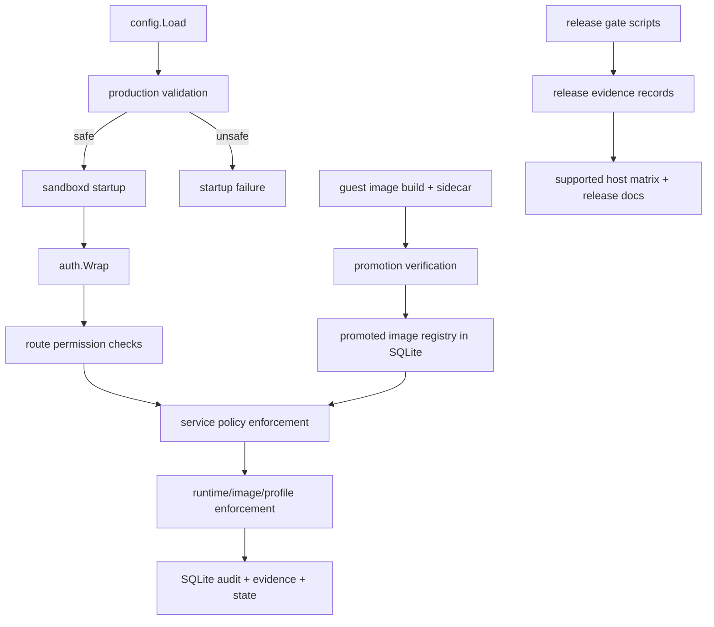

# Design

## Overview

This plan treats the user’s issue list as one coordinated production-hardening program for the existing `or3-sandbox` architecture. The right fit for this repo is not a new control plane or external policy stack; it is a set of additive changes across the current Go packages so that `production` mode becomes prescriptive, auditable, and harder to misconfigure.

The design is organized into four implementation waves:

1. **Boundary and identity hardening**
   - lock production to VM-backed runtime defaults, safe profile defaults, reviewed permissions, and TLS-backed serving only
2. **Artifact trust and release gates**
   - promote guest images explicitly, gate releases on shipped verification scripts, and store evidence deterministically
3. **Runtime and operator hardening**
   - close runtime enforcement gaps, harden browser tunnel capabilities, and add restore/bootstrap flows
4. **Governance and simplification**
   - reduce config sprawl with supported deployment profiles and dangerous-profile exception paths

This stays aligned with the current codebase because the repo already has the foundational pieces:

- config validation in `internal/config`
- role and JWT auth in `internal/auth`
- policy, audit, quotas, and reconcile logic in `internal/service`
- runtime posture and browser tunnel handling in `internal/api`
- guest-image contracts in `internal/guestimage`
- SQLite migrations in `internal/db`
- release and drill scripts in `scripts/`
- operator checks in `cmd/sandboxctl/doctor.go`

## Affected areas

- `internal/config/config.go`
  - tighten production defaults, add explicit production TLS mode, add deployment profile selection, and reject unsafe runtime/profile combinations earlier
- `internal/auth/identity.go`
  - replace wildcard roles with explicit permission sets and production role names
- `internal/auth/authenticator.go`
  - extend JWT claims/service-account handling for scope, expiry, and revocation-aware lookups
- `internal/api/router.go`
  - keep route-level permission checks explicit, expose runtime class clearly, and harden tunnel signed-URL/browser-cookie behavior
- `internal/service/policy.go`
  - centralize production-safe profile policy, dangerous-profile exception handling, and release/image policy checks
- `internal/service/service.go`
  - enforce tunnel revocation semantics, runtime enforcement outcomes, restore behavior, and audit events for overrides
- `internal/service/observability.go`
  - extend launch-critical signals without adding a separate observability stack
- `internal/guestimage/contract.go`
  - keep the sidecar contract authoritative and extend validation to promotion and restore checks
- `internal/db/db.go`
  - add small additive tables and indexes for service accounts, promoted images, release evidence, deployment profiles, or tunnel capability nonces where required
- `internal/repository/store.go`
  - add CRUD/query paths for the new additive records while preserving existing tenant/sandbox/snapshot behavior
- `cmd/sandboxctl/doctor.go`
  - evolve from production-QEMU posture checks into a single operator readiness/bootstrap report and config lint surface
- `cmd/sandboxd/main.go`
  - fail startup on missing production TLS posture or unsupported deployment profile combinations
- `scripts/production-smoke.sh`
  - remain the fast package gate and feed into a broader release gate wrapper
- `scripts/qemu-host-verification.sh`, `scripts/qemu-production-smoke.sh`, `scripts/qemu-recovery-drill.sh`, `scripts/qemu-resource-abuse.sh`
  - become required evidence producers rather than optional docs references
- `docs/operations/*`, `docs/configuration.md`, `README.md`
  - publish the supported host matrix, test matrix, readiness workflow, dangerous-profile policy, and deployment profiles

## Control flow / architecture

The hardening work keeps the existing request path and adds stronger checks around it.



### 1. Production boundary and runtime policy

Current code already rejects non-VM default runtime selections in production, but it still allows broader combinations than the desired production story.

Planned behavior:

- treat `qemu-professional` as the default production runtime selection
- allow `docker-dev` only in development or through a break-glass production override
- normalize production-safe profile defaults in config rather than relying only on docs
- surface runtime class in startup logs, `GET /v1/runtime/info`, sandbox inspect, and release evidence so operators can prove which boundary was actually used

This is primarily a change in `internal/config`, `internal/service/policy.go`, `internal/api/router.go`, and `cmd/sandboxd/main.go`.

### 2. Authorization and TLS posture

The repo currently has explicit route-level checks, but role expansion still happens through wildcard grants. The smallest viable fix is to preserve the existing permission vocabulary and replace wildcard role expansion with a reviewed permission catalog.

Proposed shape:

- keep permission strings in `internal/auth/identity.go`
- replace `admin`, `operator`, `developer`, `viewer`, and `service` with production-oriented roles:
  - `tenant-admin`
  - `tenant-developer`
  - `tenant-viewer`
  - `operator`
  - `service-account`
- add an explicit route-permission review table in tests so each handler remains covered when new endpoints are added
- extend JWT claims with additive fields for service-account identity and scope

Suggested JWT claim additions:

```go
type jwtClaims struct {
    TenantID         string   `json:"tenant_id"`
    Roles            []string `json:"roles"`
    ServiceAccountID string   `json:"service_account_id,omitempty"`
    Scope            []string `json:"scope,omitempty"`
    Service          bool     `json:"service"`
    jwt.RegisteredClaims
}
```

For TLS, production should no longer allow an ambiguous plain-HTTP mode. Keep two accepted production transport modes:

- `direct-tls`: `SANDBOX_TLS_CERT_PATH` + `SANDBOX_TLS_KEY_PATH`
- `terminated-proxy`: trusted reverse proxy mode with explicit HTTPS operator host and explicit production proxy-trust flag

This avoids breaking proxy deployments while still making plaintext production startup impossible.

### 3. Service-account scoping and revocation

Service-account support should stay simple and deterministic.

Recommended persistence:

- additive SQLite table for service accounts
- additive SQLite table for service-account bindings or revocations if revocation cannot be derived from one record

Minimal schema direction:

```sql
CREATE TABLE service_accounts (
  service_account_id TEXT PRIMARY KEY,
  tenant_id TEXT NOT NULL,
  name TEXT NOT NULL,
  scope_json TEXT NOT NULL,
  disabled INTEGER NOT NULL DEFAULT 0,
  expires_at TEXT,
  created_at TEXT NOT NULL,
  revoked_at TEXT
);
```

JWTs remain externally signed or operator-issued, but runtime authorization consults SQLite to ensure the service account still exists, is tenant-bound, is unrevoked, and has not expired.

### 4. Guest-image promotion as a first-class policy input

The repo already has sidecar guest-image contracts and validation. The missing production piece is a promotion record that tells the control plane which validated images are actually allowed.

Recommended approach:

- keep `internal/guestimage/contract.go` authoritative for image checksum and contract validation
- add a small SQLite-backed promoted-image registry, keyed by image path or normalized artifact identifier
- record:
  - image hash
  - sidecar contract version/profile/control mode
  - provenance fields already exposed by the sidecar
  - verification result
  - promotion status
  - promoted-by/promoted-at metadata

Minimal table direction:

```sql
CREATE TABLE promoted_guest_images (
  image_ref TEXT PRIMARY KEY,
  image_sha256 TEXT NOT NULL,
  profile TEXT NOT NULL,
  control_mode TEXT NOT NULL,
  control_protocol_version TEXT NOT NULL,
  contract_version TEXT NOT NULL,
  provenance_json TEXT NOT NULL,
  verification_status TEXT NOT NULL,
  promotion_status TEXT NOT NULL,
  promoted_at TEXT,
  promoted_by TEXT
);
```

Production QEMU create/restore flows should consult this table in `internal/service/policy.go` before allowing image use.

### 5. Release evidence and supported host matrix

The repo already ships the right drill scripts; the missing piece is making them a release input instead of a suggestion.

Recommended shape:

- add a small `sandboxctl release-gate` or `sandboxctl verify production` wrapper that runs or coordinates the existing scripts
- capture bounded evidence records in SQLite or JSON artifacts written to a configured directory
- publish the supported host matrix from recorded evidence, not prose alone

Additive persistence can stay small:

```sql
CREATE TABLE release_evidence (
  evidence_id TEXT PRIMARY KEY,
  gate_name TEXT NOT NULL,
  host_fingerprint TEXT NOT NULL,
  runtime_selection TEXT NOT NULL,
  image_ref TEXT NOT NULL DEFAULT '',
  profile TEXT NOT NULL DEFAULT '',
  outcome TEXT NOT NULL,
  artifact_path TEXT NOT NULL DEFAULT '',
  started_at TEXT NOT NULL,
  completed_at TEXT
);
```

This fits the current single-node deterministic model and avoids a separate CI service dependency inside the daemon.

### 6. Runtime enforcement and hardened defaults

The codebase already has admission controls and Docker hardening knobs, but those knobs are optional. The plan should close the gap in two layers:

- **policy/defaults layer**
  - deployment profiles turn on seccomp/AppArmor/SELinux defaults automatically where supported
  - production-safe defaults for disk/tmpfs/resource limits are emitted from config
- **verification layer**
  - abuse drills prove the sandbox experiences bounded degradation/denial under CPU, memory, disk, file-count, PID, and stdout pressure

This does not require a new scheduler. It requires more explicit enforcement checks in runtime managers and better drill coverage through the existing scripts and tests.

### 7. Tunnel/browser hardening

Current tunnel handling already supports TTL bounds, revocation, bootstrap cookies, and origin checks. The next step is to make browser capability issuance more explicitly revocable.

Recommended additive design:

- keep HMAC-signed capability URLs for simplicity
- optionally persist a nonce record for one-time or revocable browser bootstrap capabilities
- keep revocation local to SQLite and tunnel identity; do not add server-side session stores beyond bounded nonce records

Possible table when one-time semantics are enabled:

```sql
CREATE TABLE tunnel_capabilities (
  capability_id TEXT PRIMARY KEY,
  tunnel_id TEXT NOT NULL,
  nonce_hash TEXT NOT NULL,
  path TEXT NOT NULL,
  expires_at TEXT NOT NULL,
  consumed_at TEXT,
  revoked_at TEXT,
  created_at TEXT NOT NULL
);
```

This lets `internal/api/router.go` reject consumed or revoked nonces while preserving the current signed-cookie model for normal flows.

### 8. Snapshot integrity and restore compatibility

Snapshots already record runtime and contract metadata. The plan extends that to integrity and upgrade confidence.

Recommended additions:

- store snapshot bundle checksum/manifest or record it alongside the snapshot workspace archive
- verify promoted image compatibility before restore
- add restore drill coverage for:
  - clean-host restore
  - daemon restart during or after snapshot operations
  - corrupted or incomplete snapshot artifacts
  - restore across supported version upgrades

This likely needs additive snapshot metadata columns or a companion manifest file, but it should not change the current snapshot model or require a new backup subsystem.

### 9. Operator bootstrap and deployment profiles

The repo already has `sandboxctl doctor --production-qemu`. The next logical step is not a separate installer; it is a more opinionated readiness workflow.

Recommended approach:

- extend doctor to emit a single red/green production readiness report
- add config lint rules in `internal/config/config.go` and reuse them from doctor
- introduce deployment profiles in config, for example:
  - `dev-trusted-docker`
  - `production-qemu-core`
  - `production-qemu-browser`
  - `exception-container`
- implement deployment profiles as config presets layered on top of current env vars, with explicit override rules

This keeps operator choice bounded without removing advanced overrides.

### 10. Observability and test visibility

The repo already exposes runtime health, capacity, metrics, and audit counts. The plan should extend only what is necessary for launch-critical monitoring:

- image promotion posture
- release gate freshness
- degraded runtime counts
- tunnel revoke/denial churn
- storage pressure and restore failures
- dangerous-profile override usage

For test visibility, documentation should publish the matrix directly from what the code and scripts already execute:

- unit tests: `internal/config`, `internal/auth`, `internal/service`, `internal/api`, `cmd/sandboxctl`
- host-gated tests: QEMU verification/integration
- operator drills: smoke, abuse, recovery, restore

## Data and persistence

- **SQLite migrations:** likely required
  - service-account records
  - promoted guest image registry
  - release evidence records
  - optional tunnel capability nonce records
- **Existing tables remain authoritative for:** tenants, quotas, sandboxes, snapshots, tunnels, executions, audit events
- **Config changes:** likely additive
  - production transport mode / TLS termination mode
  - deployment profile selector
  - production break-glass flags for Docker and dangerous profiles
  - optional release-evidence output directory
- **Session or memory scope:** none beyond current tenant/session behavior; this repo is not adding a new chat-memory model

## Interfaces and types

Representative Go-facing changes:

```go
type ProductionTransportMode string

const (
    ProductionTransportModeDirectTLS      ProductionTransportMode = "direct-tls"
    ProductionTransportModeTerminatedProxy ProductionTransportMode = "terminated-proxy"
)
```

```go
type ServiceAccountScope struct {
    Permissions []string `json:"permissions,omitempty"`
    Profiles    []string `json:"profiles,omitempty"`
    Tunnels     []string `json:"tunnels,omitempty"`
}
```

```go
type PromotedGuestImage struct {
    ImageRef               string
    ImageSHA256            string
    Profile                string
    ControlMode            string
    ControlProtocolVersion string
    ContractVersion        string
    VerificationStatus     string
    PromotionStatus        string
    PromotedAt             *time.Time
}
```

Potential CLI additions:

- `sandboxctl doctor --production-report`
- `sandboxctl config lint`
- `sandboxctl image promote`
- `sandboxctl image list --promoted`
- `sandboxctl release-gate production-qemu`

These should reuse existing packages rather than introducing a separate operator daemon.

## Failure modes and safeguards

- **Invalid config**
  - `config.Load` must fail before startup on unsafe production combinations such as plaintext transport, Docker default runtime in production, dangerous profile defaults, or missing release-critical image policy
- **Migration failures**
  - additive migrations must preserve existing sandboxes, snapshots, and audit data; failures abort startup cleanly without partial schema assumptions
- **Permission drift**
  - route-level tests fail if endpoints lack explicit permission coverage
- **Service-account misuse**
  - expired, revoked, cross-tenant, or overscoped service accounts are denied before request handling
- **Image promotion drift**
  - sidecar-valid but unpromoted images are denied in production
- **Release evidence drift**
  - stale or missing evidence prevents production-ready claims, but does not block development mode
- **Tunnel misuse**
  - consumed, revoked, expired, or cross-tenant browser capabilities fail closed
- **Oversized evidence or logs**
  - store bounded summaries and artifact paths, not unbounded raw output blobs in SQLite
- **Restore compatibility errors**
  - restore must fail conservatively when snapshot/image contract versions drift beyond the supported window

## Testing strategy

- **Unit tests**
  - `internal/config/config_test.go` for production transport modes, deployment profiles, break-glass flags, and dangerous-profile defaults
  - `internal/auth/authenticator_test.go` and `internal/auth/identity.go` tests for role expansion, service-account expiry, scope checks, and no-wildcard guarantees
  - `internal/service/service_test.go` and `internal/service/policy.go` tests for image promotion enforcement, dangerous-profile approval, tunnel capability revocation, and restore policy
  - `internal/api/integration_test.go` for endpoint permission mapping, runtime class exposure, browser tunnel TTL/nonce/revocation, and TLS-expected behavior where testable
- **SQLite-backed integration tests**
  - `internal/db/db_test.go` and repository tests for additive migrations and query behavior around promoted images, service accounts, and release evidence
- **CLI tests**
  - `cmd/sandboxctl/main_test.go` and `cmd/sandboxctl/preset_test.go` for doctor/config-lint/image-promotion/release-gate flows
- **Host-gated verification**
  - keep `scripts/qemu-host-verification.sh`, `scripts/qemu-production-smoke.sh`, `scripts/qemu-resource-abuse.sh`, and `scripts/qemu-recovery-drill.sh` as the required production evidence path
- **Documentation regression**
  - update README and operations docs together with command/env-name changes so production claims map to real commands and real evidence
