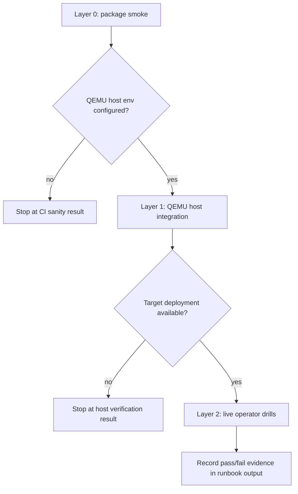

# Design

## Overview

The solution is a layered production verification program built on top of existing repo primitives:

- fast package tests in `scripts/production-smoke.sh`
- host-gated QEMU integration tests in `internal/runtime/qemu`
- service and API regression tests in `internal/service` and `internal/api`
- operator-driven drills documented under `docs/operations`
- optional script wrappers using existing `sandboxctl` commands rather than new control-plane features

The updated QEMU direction changes one important assumption: verification can no longer treat “the guest image” as a single broad environment controlled over SSH. The verification design now needs to track:

- the minimal `core` substrate profile separately from additive profiles such as `browser` and `container`
- the production-default guest-agent control path separately from any SSH/debug compatibility path

This fits the current architecture because `or3-sandbox` already distinguishes between:

- control-plane correctness (`internal/config`, `internal/auth`, `internal/service`, `internal/api`, `cmd/sandboxctl`)
- runtime-boundary validation (`internal/runtime/qemu/host_integration_test.go`)
- operational procedures (`docs/operations/*`)

The main change is not a new service. It is a clearer and broader verification envelope around the existing daemon, runtime, CLI, and runbooks.

## Affected areas

- `scripts/production-smoke.sh`
  - keep as the fast CI sanity gate; adjust naming and inline messaging only if needed so it does not overclaim production readiness
- `scripts/`
  - add one or two small wrapper scripts for gated host verification and optional live operator drills, reusing `go test` and `sandboxctl`
- `internal/runtime/qemu/host_integration_test.go`
  - extend host-gated QEMU coverage with profile-aware substrate checks, control-protocol negotiation checks, and isolation-boundary/restart/recovery checks specific to the supported production boundary
- `internal/service/service_test.go`
  - expand regression coverage for tunnel policy, dangerous-profile policy, storage pressure, partial failure persistence, and reconcile behavior
- `internal/api/integration_test.go`
  - add API-level coverage for tunnel auth, signed URL limits, admin inspection flows, and any profile-selection/immutable-profile behavior exposed at the API layer
- `cmd/sandboxctl`
  - only add verification helpers if existing commands are insufficient; prefer thin wrappers over new runtime behavior
- `docs/operations/verification.md`
  - redefine production verification as a layered, profile-aware process and document exact commands per layer
- `docs/operations/incidents.md`
  - add drill follow-ups for disk exhaustion, restart recovery, and tunnel misuse findings
- `docs/operations/production-deployment.md`
  - clarify supported hostile boundary claims and residual risk language
- `docs/operations/upgrades.md`
  - require post-upgrade recovery and verification drills beyond package smoke

## Control flow / architecture

The verification flow should be staged rather than collapsed into a single slow script.



### Layer 0: package smoke

- Keep `./scripts/production-smoke.sh` as today’s fast `go test` bundle for core packages.
- Treat failures here as blockers for any later verification.
- Keep it runnable in generic CI without QEMU guest prerequisites.

### Layer 1: host-gated QEMU verification

- Add or extend targeted tests in `internal/runtime/qemu/host_integration_test.go`.
- These tests should run only when the existing QEMU env prerequisites are present.
- They should cover:
  - `core` substrate behavior: boot, readiness, exec, PTY, files, and restart persistence
  - guest-agent handshake and protocol/version negotiation
  - guest disk-full behavior and post-restart persistence
  - restart durability for representative workloads on the profiles that actually declare those capabilities
  - isolation assumptions, such as no host bind-mount leakage or direct host secret visibility
  - conservative behavior under reconcile or restart scenarios

If compatibility SSH coverage remains during migration, keep it in a separate test group that does not count as the production-default verification path.

### Layer 2: live operator drills

- Use existing HTTP endpoints and `sandboxctl` commands such as:
  - `runtime-health`
  - quota/capacity inspection
  - preset-driven sandbox creation
  - snapshot create/restore flows
-   - profile-specific smoke presets or commands where needed
- Keep these drills mostly read-only or temporary by default.
- For restart or restore drills, require explicit operator opt-in and documented cleanup.

### Documentation and evidence

- `docs/operations/verification.md` becomes the authoritative index for the layered flow.
- Scripts should print enough context to show which layer ran, which checks were skipped because the environment was missing, and where the operator should look next.

## Data and persistence

### SQLite and migrations

No schema change is required for the initial plan.

Existing tables, state transitions, and audit events already support most of the needed verification evidence:

- sandbox state and runtime state
- snapshot state
- tenant usage and quota pressure
- audit events for policy denials and lifecycle actions

If implementation later reveals a narrow observability gap, it should be handled as an additive change only, but the default plan assumes no migration.

### Config and environment

No new mandatory config is required.

Expected existing environment inputs:

- package smoke: none beyond Go availability
- QEMU host verification:
  - `SANDBOX_QEMU_BINARY`
  - `SANDBOX_QEMU_BASE_IMAGE_PATH`
  - optional `SANDBOX_QEMU_ACCEL`
  - any profile/control-mode settings added by the QEMU plan
- live operator drills:
  - `SANDBOX_API`
  - `SANDBOX_TOKEN` or JWT-equivalent auth material
  - deployment-specific paths or supervisor commands only when running restart drills

### Session or memory implications

None. This repo is sandbox-control-plane oriented and does not require new session or long-term memory behavior for this plan.

## Interfaces and types

The design should stay Go-native and reuse current entry points.

Likely test surfaces:

```go
func TestHostDiskFullAndWorkspacePersistence(t *testing.T)
func TestHostWorkloadClaimsAndRestartDurability(t *testing.T)
func TestHostIsolationBoundaryAssumptions(t *testing.T)
func TestHostRestartRecoveryAndReconcile(t *testing.T)
```

Possible API and service regression surfaces:

```go
func TestCreateTunnelPolicyDenials(t *testing.T)
func TestTunnelSignedURLTTLBounds(t *testing.T)
func TestTunnelAuthRequired(t *testing.T)
func TestDangerousProfileDeniedInProduction(t *testing.T)
func TestCapacityReportUnderStoragePressure(t *testing.T)
func TestReconcileAfterRestartPreservesSandboxState(t *testing.T)
```

Possible script layout:

```text
scripts/
  production-smoke.sh          # fast CI sanity gate
  production-host-verify.sh    # gated QEMU host test wrapper
  production-operator-drill.sh # optional live checks using sandboxctl/api
```

The live drill script should be shell-only and compose existing commands rather than adding a new daemon API.

## Failure modes and safeguards

- **Missing QEMU prerequisites**
  - host verification must skip with an explicit message instead of failing ambiguously
- **Wrong profile being used for a given verification claim**
  - scripts and docs must print the selected profile and control mode so operators can tell whether they validated `core`, `browser`, `container`, or a debug/compat image
- **Accidental overclaiming**
  - docs and script output must separate “sanity passed” from “production verification passed”
- **SSH compatibility coverage being mistaken for production-default coverage**
  - keep SSH/debug checks separate and clearly labeled as compatibility-only
- **Tunnel misuse testing on live systems**
  - use disposable sandboxes and revoke tunnels during cleanup
  - never print raw secrets beyond the minimum already returned by existing CLI flows
- **Restart drills on live systems**
  - do not restart by default; require explicit operator action or flag
  - always perform post-restart `runtime-health`, capacity, and audit inspection
- **Disk pressure drills causing durable damage**
  - keep host-gated exhaustion tests in temporary environments
  - on live systems, prefer inspection over intentionally filling disks
- **Isolation regression tests becoming flaky**
  - check stable repo-specific assumptions such as inaccessible host-only paths, absent docker socket, absent mounted secret files, and preserved tenant scoping
  - avoid speculative exploit tests or dependence on undefined guest packages
- **Production mode confusion with Docker**
  - docs must continue to state that Docker is not the hostile multi-tenant production boundary

## Testing strategy

### Unit and package regression tests

Use Go’s `testing` package in the existing packages:

- `internal/service`
  - tunnel policy denials
  - storage pressure and partial failure persistence
  - reconcile and lifecycle state handling
- `internal/api`
  - tunnel auth enforcement, TTL bounds, and admin inspection endpoints
- `cmd/sandboxctl`
  - any wrapper behavior or operator-drill command formatting, if new CLI helpers are added

### Host-gated integration tests

Use `internal/runtime/qemu/host_integration_test.go` for environment-gated QEMU coverage:

- `core` substrate verification
- control-protocol negotiation
- disk exhaustion and restart durability
- representative workload persistence only on relevant profiles
- isolation-boundary assumptions
- reconcile or restart recovery expectations

### Operator verification coverage

Document exact commands and expected evidence in `docs/operations/verification.md` and related runbooks.

Suggested drill categories:

- startup and health inspection
- tunnel creation and misuse denial
- daemon restart and reconcile verification
- snapshot create/restore verification
- storage pressure inspection after a controlled failure or prebuilt fixture

### Regression discipline

Every new protection claim should map to at least one of:

- a Go regression test
- a host-gated integration test
- a documented operator drill with deterministic inspection output

That keeps the verification program broad enough for production posture while staying aligned with the repo’s simple Go/SQLite/QEMU architecture.
