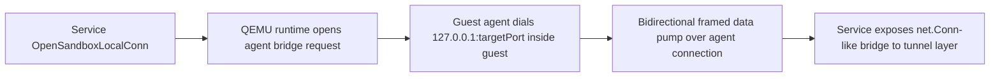

# Design

## Overview

This hardening pass keeps the current QEMU architecture intact:

- `sandboxd` remains a single Go daemon with SQLite metadata
- the production-default control path remains guest-agent over virtio-serial
- guest images remain fixed-profile qcow2 artifacts with sidecar contracts

The work is intentionally incremental. Instead of adding a new tunnel service, protocol broker, or host-side session layer, it strengthens the existing seams that are still too permissive:

- the guest-agent framing and operation contract
- workspace file transfer behavior
- PTY state handling
- tunnel bridging inside the substrate
- host posture validation in `sandboxctl doctor`
- build provenance for guest images

This fits the repo because the relevant behavior already lives in a small number of packages and scripts, and the current runtime already negotiates control mode, protocol version, and image contracts.

## Affected areas

- `cmd/or3-guest-agent/main.go`
  - enforce per-message limits, request/response ID handling, capability gating, bounded file transfer, and stricter PTY session validation
- `internal/runtime/qemu/agentproto/protocol.go`
  - define the tightened wire format, limit constants, file-chunk request/response types, and protocol-version update if required
- `internal/runtime/qemu/agent_client.go`
  - validate request IDs/session IDs, adapt workspace helpers to chunked reads/writes, and add a substrate-owned tunnel bridge client path
- `internal/runtime/qemu/workspace.go`
  - preserve current file APIs while moving the underlying agent transport to bounded chunking
- `internal/service/tunnel_tcp.go`
  - replace the current PTY + shell-script bridge bootstrap with an agent-backed local TCP bridge flow
- `internal/runtime/qemu/runtime_test.go`
  - add regression coverage for protocol mismatch, capability mismatch, chunked file transfer, PTY misuse, and tunnel bridge behavior
- `internal/service/service_test.go`
  - cover tunnel bridge integration and failure cases at the service layer
- `cmd/sandboxctl/doctor.go`
  - extend production doctor with disk-headroom, cgroup/controller, permission, and tunnel-key posture checks
- `cmd/sandboxctl/main_test.go`
  - add focused tests for the new doctor findings and output classes
- `internal/config/config.go`
  - reuse existing transport/runtime config fields for doctor checks; add new config only if a threshold truly needs an operator override
- `internal/guestimage/contract.go`
  - extend sidecar metadata if stronger provenance fields are needed for release promotion
- `internal/guestimage/contract_test.go`
  - verify new provenance validation or loading behavior
- `images/guest/build-base-image.sh`
  - emit stronger provenance and optional pinned-input validation during image builds
- `images/guest/README.md`
  - document the revised reproducibility claims and release-bundle requirements
- `docs/operations/verification.md`
  - update production verification guidance to reflect the deeper doctor and provenance expectations
- `docs/operations/qemu-production-threat-model.md`
  - clarify the hardened guest-agent and tunnel assumptions where needed

## Control flow / architecture

### 1. Hardened guest-agent request flow

1. Host runtime writes a framed request with:
   - protocol-compatible operation
   - required request ID
   - bounded payload
2. Guest agent rejects frames that exceed max size or violate basic shape.
3. Guest agent loads/holds the allowed capability set for the image profile.
4. Guest agent validates:
   - operation known
   - capability allowed
   - payload schema valid
   - path/session/request constraints valid
5. Guest agent replies with the same request ID and a deterministic success/error payload.

A protocol version bump is justified if the request ID and file-chunk semantics cannot be introduced safely as a purely additive change. Because the runtime already checks exact guest protocol version against the image contract, rollout can remain explicit and deterministic.

### 2. Bounded file transfer

Replace whole-file `file_read` / `file_write` behavior with chunk-aware operations while keeping host-side user APIs stable.

Likely protocol shape:

```go
type FileReadRequest struct {
	Path   string `json:"path"`
	Offset int64  `json:"offset,omitempty"`
	Limit  int    `json:"limit,omitempty"`
}

type FileReadResult struct {
	Path      string `json:"path"`
	Offset    int64  `json:"offset"`
	Content   string `json:"content"`
	EOF       bool   `json:"eof,omitempty"`
	TotalSize int64  `json:"total_size,omitempty"`
}
```

Host-side helpers loop until EOF or an explicit max-size threshold is reached. This keeps memory usage bounded and avoids a separate streaming subsystem.

### 3. PTY state validation

The current model stays “single PTY session per agent connection,” but it becomes explicit and enforced.

- `pty_open` creates one active session state object
- `pty_data`, `pty_resize`, and `pty_close` must carry the active session ID
- wrong or missing session IDs fail closed
- once the command exits or the PTY closes, subsequent PTY messages are rejected

This preserves minimalism while preventing accidental protocol sloppiness from becoming part of the contract.

### 4. Substrate-owned tunnel bridge

The current tunnel bridge shells into the guest and probes for `python3`, `python`, `node`, `nc`, and `busybox nc`. That should be replaced with a fixed substrate path.

Preferred approach: add an agent-backed TCP bridge operation over the existing guest-agent transport.

High-level flow:



Benefits:

- no dependence on guest language runtimes or helper binaries
- works on the minimal `core` profile
- keeps bridge logic in the same trusted substrate as exec/files/PTY

A tiny fixed helper binary is the fallback only if the agent path becomes too complex, but the initial design should bias toward the agent since it already owns the control channel.

### 5. Stronger production doctor

Extend `runProductionQEMUDoctor()` with host checks that match the repo’s actual runtime assumptions.

Likely check groups:

- **disk posture**
  - filesystem free-space thresholds for DB, storage, and snapshot roots
- **secret posture**
  - existing JWT secret checks plus tunnel signing key readability and restrictive mode checks
- **runtime-root posture**
  - storage/snapshot/runtime directory permissions and whether `.runtime` artifacts like monitor/agent sockets would land under permissive parents
- **host capability posture**
  - cgroup/controller availability required by the daemon/runtime model
  - Linux/KVM prerequisites already checked today remain in place
- **network posture**
  - conservative warnings when production-facing operator/tunnel settings imply weak exposure assumptions

The doctor should stay read-only and deterministic. It should not attempt to modify permissions, create firewall rules, or mutate host state.

### 6. Stronger image provenance

The build pipeline already emits a sidecar contract, resolved profile manifest, and package inventory. The remaining step is to make provenance more deliberate and release-oriented.

Expected additions:

- base image identity and optional expected checksum validation
- manifest hash for the resolved guest profile
- package/source provenance metadata describing what was actually installed
- explicit documentation that this is stronger provenance, not full reproducibility

Possible additive sidecar fields:

```go
type BuildProvenance struct {
	BaseImageURL        string `json:"base_image_url,omitempty"`
	BaseImageSHA256     string `json:"base_image_sha256,omitempty"`
	ResolvedManifestSHA string `json:"resolved_manifest_sha256,omitempty"`
	PackageInventorySHA string `json:"package_inventory_sha256,omitempty"`
	AptSourceSummary    string `json:"apt_source_summary,omitempty"`
}
```

These fields can be additive without requiring SQLite changes because the sidecar contract is file-backed and already loaded on demand.

## Data and persistence

- **SQLite:** no schema or migration changes are required for this hardening pass.
  - the affected state is runtime-local, protocol-local, or image-contract file metadata
- **Config/env:**
  - existing config already exposes `OperatorHost`, `TunnelSigningKey`, `TunnelSigningKeyPath`, runtime roots, and QEMU/image settings needed by the expanded doctor
  - new config should be avoided unless a threshold clearly benefits from operator control; fixed conservative defaults are preferred first
- **Guest image artifacts:**
  - sidecar contract files may gain additive provenance fields
  - build output may gain an additional provenance file if that is cleaner than overloading the sidecar
- **Session/memory scope:** none beyond the existing per-connection PTY session state and per-bridge connection state

## Interfaces and types

### Guest-agent protocol

Potential protocol additions/changes:

```go
const ProtocolVersion = "2"

const (
	MaxMessageBytes   = 256 * 1024
	MaxFileChunkBytes = 64 * 1024
)

type Message struct {
	ID     string          `json:"id"`
	Op     string          `json:"op"`
	OK     bool            `json:"ok,omitempty"`
	Error  string          `json:"error,omitempty"`
	Result json.RawMessage `json:"result,omitempty"`
}
```

Possible new bridge message types:

```go
type TCPBridgeOpenRequest struct {
	TargetPort int `json:"target_port"`
}

type TCPBridgeData struct {
	BridgeID string `json:"bridge_id"`
	Data     string `json:"data,omitempty"`
	EOF      bool   `json:"eof,omitempty"`
}
```

The exact bridge types can be refined during implementation, but the key is to avoid shelling into the guest for helper discovery.

### Capability source

Rather than hardcoding `[]string{"exec", "pty", "files", "shutdown"}` in the guest agent forever, load allowed capabilities from the fixed profile manifest or a small derived contract file placed in the guest image at build time.

That keeps the agent’s own boundary aligned with the same image/profile declarations the host already uses.

## Failure modes and safeguards

- **Protocol misuse**
  - oversize frames, missing IDs, bad JSON, or unknown ops fail closed with deterministic errors
- **Capability drift**
  - if guest-reported capabilities differ from the image contract, startup or handshake fails clearly rather than silently widening trust
- **Large file abuse**
  - chunked file reads/writes cap RAM usage and reject impossible payload sizes early
- **PTY desynchronization**
  - wrong-session data/resize/close requests are rejected and do not mutate terminal state
- **Tunnel bridge failures**
  - unavailable target ports, connect errors, or bridge open failures surface as explicit service/runtime errors
  - bridge EOF and close semantics remain bounded and deterministic
- **Doctor false confidence**
  - each new doctor check should fail or warn narrowly, with wording tied to the actual host/runtime requirement
- **Image provenance overclaiming**
  - docs must distinguish “recorded and validated inputs” from “fully reproducible build” until upstream cloud-image and apt-source pinning are stronger

## Testing strategy

Use Go’s `testing` package with focused unit/regression coverage first, then host-gated QEMU verification where the behavior truly needs it.

- **Unit / package tests**
  - `internal/runtime/qemu/agentproto`: frame-size and request-ID validation
  - `internal/runtime/qemu/runtime_test.go`: protocol mismatch, capability mismatch, chunked file operations, PTY session enforcement, and bridge protocol behavior against fake agent endpoints
  - `internal/service/service_test.go`: tunnel bridge integration and target-port failures
  - `cmd/sandboxctl/main_test.go`: doctor fail/warn/pass coverage for new checks
  - `internal/guestimage/contract_test.go`: additive provenance field load/validation behavior
- **Build/test scripts**
  - update `images/guest/build-base-image.sh` smoke expectations so `core` no longer relies on Python/Node/nc for tunnel bridging assumptions
- **Host-gated verification**
  - extend `internal/runtime/qemu/host_integration_test.go` and/or `scripts/qemu-production-smoke.sh` to prove the `core` profile can still satisfy readiness, exec, PTY, files, and local tunnel bridging with no opportunistic helper runtimes
- **Regression focus**
  - every bug-class called out in the review should have at least one targeted regression test so future protocol or runtime changes do not reopen the same seam
