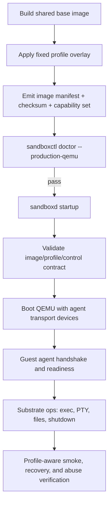

# Design

## Overview

The user’s suggestions point at the right architectural center of gravity: the biggest quality jump comes from (1) removing SSH from the default runtime contract and (2) replacing the broad guest image with a small, profile-driven image family.

The main improvement I’m making to that direction for this repo is to keep it grounded and portable:

- **use a tiny guest-agent protocol with a transport abstraction**, preferring vsock on Linux/KVM but supporting virtio-serial as the fallback/portability path
- **build the agent in Go** to match the repo’s language, tooling, and operational style
- **use a very small fixed profile set**: `core`, `runtime`, `browser`, `container`, plus optional `debug`
- **treat profiles as immutable contracts**, not a giant runtime toggle matrix
- **keep the control plane dependent only on the substrate contract**, with tooling layered on top by profile

This is more ambitious than the previous QEMU plan, but it still fits the repo because it extends existing packages instead of adding external systems.

## Affected areas

- `cmd/sandboxctl`
  - add `doctor --production-qemu` and any minimal inspection helpers for profile-aware verification
- `cmd/sandboxd`
  - continue constructing the QEMU runtime, but pass new control-mode/profile-aware options as needed
- `cmd/or3-guest-agent`
  - new tiny guest-side binary implementing the minimal control protocol in Go
- `internal/config/config.go`
  - add or derive profile/control-path validation while preserving current config compatibility
- `internal/model`
  - add profile and capability concepts to sandbox create/inspect models if the request path becomes profile-aware
- `internal/service`
  - validate profile requests, dangerous-profile policy, immutable profile behavior, and capability enforcement
- `internal/presets`
  - allow presets to request approved guest profiles instead of only broad image assumptions
- `internal/runtime/qemu/runtime.go`
  - add guest-agent transport, image-contract validation, profile/capability checks, and reduced SSH dependence
- `internal/runtime/qemu/exec.go`
  - route exec/PTY/file operations through the guest-agent transport for production-default images
- `internal/runtime/qemu/runtime_test.go`
  - unit-test protocol/version negotiation, control-mode fallback, and profile/capability validation
- `internal/runtime/qemu/host_integration_test.go`
  - extend host-gated coverage for profile-specific smoke, recovery, resource abuse, and snapshot correctness
- `images/guest/build-base-image.sh`
  - split the current broad image into shared base + profile overlays + manifest generation
- `images/guest/cloud-init/user-data.tpl`
  - shrink its role or replace it where needed so profile composition is build-time, not a single giant package list
- `images/guest/systemd/*`
  - ensure the guest-agent, workspace mount, and readiness contract come up in the minimal base image
- `images/guest/profiles/*`
  - new profile manifests/overlays describing `core`, `runtime`, `browser`, `container`, and optional `debug`
- `images/guest/README.md`
  - document the substrate contract, profile system, control protocol, and build outputs
- `internal/api/integration_test.go`
  - add profile-aware policy and capability behavior where exposed through API flows
- `scripts/qemu-production-smoke.sh`
  - become profile-aware and verify the guest-agent control path by default
- `scripts/qemu-recovery-drill.sh`
  - validate recovery with agent-based guests and profile-specific invariants
- `scripts/qemu-resource-abuse.sh`
  - collect per-profile bounded resource-abuse validation and cost measurements
- `docs/operations/*`
  - update production boundary, host profile, profile policy, dangerous-profile handling, and runbooks

## Control flow / architecture

The revised production path should be explicit from build-time image composition through runtime negotiation.



### 1. Substrate first, tooling second

The design should explicitly separate:

- **substrate contract**
  - boot
  - workspace mount
  - readiness
  - control transport
  - exec
  - PTY
  - file transfer
  - shutdown/reboot
- **tooling layers**
  - git
  - Python
  - Node
  - browsers
  - inner Docker

`sandboxd` and the QEMU runtime should depend only on the substrate contract.

That means `core` must be enough to run the runtime correctly with no assumptions about Git, Python, Node, browsers, or Docker.

### 2. Guest-agent control protocol

The control protocol should stay tiny and versioned.

Suggested operation set:

- `hello`
  - protocol version and declared capabilities
- `ready`
  - readiness state and failure reason if not ready
- `exec`
  - bounded command execution
- `pty_open`
  - interactive attach
- `file_put` / `file_get`
  - bounded file transfer rooted in allowed paths
- `shutdown`
  - controlled guest shutdown/reboot
- `heartbeat`
  - liveness and agent health

The runtime should not expose arbitrary agent-side extensibility beyond this minimum set.

### 3. Transport choice

The user is right to move away from SSH, but the repo should avoid overcommitting to only one device path too early.

Recommended transport model:

- **preferred production transport**: vsock on Linux/KVM
- **portability/fallback transport**: virtio-serial

Why this is better than a single hardcoded transport:

- Linux/KVM production gets the cleaner long-term channel
- development and migration can still use a portable transport when vsock support is not ideal
- the agent protocol stays stable even if the transport differs

The image manifest should declare:

- supported control transports
- control protocol version
- substrate contract version

### 4. Profile system

Use a small, explicit set of profiles.

#### `core`

- minimal secure execution guest
- guest agent
- workspace support
- readiness contract
- no browsers
- no inner Docker
- no broad language/tooling assumptions

#### `runtime`

- `core` plus common language/runtime tools the product wants to treat as standard
- still no browser stack
- still no inner Docker

#### `browser`

- `runtime` or `core` plus browser/Playwright dependencies only
- auto-includes any required runtime dependency such as Node when justified by the profile

#### `container`

- explicit higher-risk profile that adds inner Docker only
- documented as heavier and lower-density than `core`

#### `debug`

- non-default convenience image for diagnostics
- may include SSH and extra troubleshooting tools
- blocked from hostile production by default policy

### 5. Feature flags and validation

Feature flags should be few and heavily constrained.

Good examples:

- `git=true`
- `python=true`
- `node=true`

But they should only be allowed when the selected profile permits them. Examples:

- `core` cannot enable Docker
- `browser` implies required browser runtime dependencies automatically
- `container` is the only profile allowed to enable Docker

This avoids an open-ended toggle matrix.

### 6. Image composition and contract

The current broad cloud-init package list should be broken into:

- shared base recipe
- profile overlays
- manifest generation

The manifest should be machine-readable and include at least:

- image ID
- build timestamp
- git SHA
- profile
- control protocol version
- supported transports
- workspace contract version
- declared capabilities
- package inventory or SBOM-like summary
- whether SSH is present

At runtime, the host should validate this contract before boot and then verify the agent handshake after boot.

### 7. Privilege model

The current single passwordless-sudo SSH user is too broad.

Recommended identities:

- `or3-agent`
  - guest-agent service identity or tightly scoped control identity
- `sandbox`
  - unprivileged workload execution identity

Profile rules:

- `core`, `runtime`, and `browser`
  - no passwordless sudo for workload user
  - no Docker group
- `container`
  - only profile allowed to expose inner Docker privileges
- `debug`
  - may include diagnostic affordances but is blocked by production policy by default

### 8. Runtime request and policy model

The host needs a clean way to request and validate profiles.

Recommended request surface:

- sandbox create request carries a profile name
- optional small feature set/capability hints may be present
- service policy validates the request against approved profiles and image manifests

Production policy should ensure:

- default profile is `core`
- dangerous profiles require explicit operator/admin allowlist
- profile cannot silently drift after creation
- restore/reconcile preserves profile identity and capability expectations

## Data and persistence

### SQLite and migrations

The previous plan avoided schema work entirely. With immutable profiles and declared capabilities, a small additive persistence change is justified.

Likely additive fields:

- sandbox profile
- declared or granted capability set
- control protocol version or mode observed at creation time
- snapshot source profile/contract version metadata

These should be additive and backward compatible.

### Config and environment

Prefer minimal new config.

Likely additions or derived behavior:

- operator-approved profile set
- optional dangerous-profile allowlist
- control-mode preference such as `auto`, `agent`, or `ssh-compat` if needed during migration

Where possible, derive image contract data from sidecar manifests adjacent to image paths rather than many new env vars.

### Session or memory implications

None for chat/session memory. Resource-wise, the new profile system should enable lower guest RAM and faster boot for `core`.

## Interfaces and types

Possible Go-oriented additions:

```go
type GuestProfile string

const (
	GuestProfileCore      GuestProfile = "core"
	GuestProfileRuntime   GuestProfile = "runtime"
	GuestProfileBrowser   GuestProfile = "browser"
	GuestProfileContainer GuestProfile = "container"
	GuestProfileDebug     GuestProfile = "debug"
)

type GuestCapability string

type ImageContract struct {
	ImageID                 string
	BuildGitSHA             string
	BuildTimestamp          time.Time
	Profile                 GuestProfile
	ControlProtocolVersion  string
	SupportedTransports     []string
	WorkspaceContract       string
	Capabilities            []GuestCapability
	PackageInventoryDigest  string
	HasSSH                  bool
}
```

Potential request model updates:

```go
type CreateSandboxRequest struct {
	BaseImageRef string            `json:"base_image_ref,omitempty"`
	Profile      GuestProfile      `json:"profile,omitempty"`
	Features     map[string]bool   `json:"features,omitempty"`
	// existing resource fields remain
}
```

Possible new QEMU runtime helpers:

```go
func loadImageContract(baseImagePath string) (ImageContract, error)
func validateProfileRequest(contract ImageContract, profile GuestProfile, features map[string]bool) error
func negotiateGuestAgent(ctx context.Context, sandbox model.Sandbox) (AgentSession, error)
```

## Failure modes and safeguards

- **Image boots but guest agent never handshakes**
  - runtime reports explicit protocol/readiness failure and captures serial logs for diagnosis
- **Profile request does not match image contract**
  - service or runtime rejects it before boot
- **Dangerous profile requested in production**
  - policy denial with audit event
- **Transport support differs by host**
  - runtime selects supported transport according to policy and manifest; production docs remain Linux/KVM-first
- **Feature flags drift into a toggle matrix**
  - validation rejects unsupported combinations and docs keep the feature list intentionally small
- **Transitional SSH compatibility lingers forever**
  - docs and policy mark SSH as debug/compat only, not the production default
- **Profile explosion hurts simplicity**
  - keep the supported profile set fixed and small; new profiles require explicit design review

## Testing strategy

### Unit and package tests

Use Go’s `testing` package in:

- `internal/config`
  - profile/control-mode validation
- `internal/service`
  - immutable profile policy and dangerous-profile denial
- `internal/presets`
  - profile-aware preset validation
- `internal/runtime/qemu`
  - image-contract validation, protocol negotiation, capability enforcement
- `cmd/sandboxctl`
  - doctor and profile-oriented operator commands

### Host-gated integration tests

Extend `internal/runtime/qemu/host_integration_test.go` for:

- `core` substrate smoke
- `browser` profile capability validation
- `container` profile capability validation
- guest-agent handshake and recovery
- snapshot integrity across profiles
- resource-abuse scenarios on `core` and at least one heavier profile

### Scripted operator verification

Use bounded shell wrappers under `scripts/`:

- `qemu-production-smoke.sh`
- `qemu-recovery-drill.sh`
- `qemu-resource-abuse.sh`

These should report profile, control protocol, and capability evidence explicitly.

## Out-of-scope follow-ons

These are useful after the first clean profile/guest-agent architecture lands, but should not be folded into the initial implementation scope:

- a broad plugin-style guest capability system
- distributed control planes or multi-host orchestration
- unbounded chaos frameworks
- a large runtime toggle matrix
- dozens of guest profiles beyond the fixed approved set

### CLI surface

Add a doctor subcommand in `cmd/sandboxctl`:

```go
func runDoctor(client clientConfig, args []string) error
```

Suggested usage:

```text
sandboxctl doctor --production-qemu
```

The command is local/read-only and may not need API access.

### Runtime-side helpers

Potential internal helpers in `internal/runtime/qemu`:

```go
type ImageContract struct {
    ImageSHA256           string
    BuildGitSHA           string
    BuildTimestamp        time.Time
    OSRelease             string
    ControlUser           string
    WorkloadUser          string
    InnerDockerEnabled    bool
    ReadyMarkerPath       string
    SSHHostKeyFingerprint string
    Profile               string
}

func loadImageContract(baseImagePath string) (ImageContract, error)
func validateProductionImageContract(baseImagePath string, hostKeyPath string) error
```

### Config-side validation

Possible production-specific validation entry points:

```go
func validateProductionQEMUProfile(c Config) error
```

### Test surfaces

Representative additions:

```go
func TestDoctorProductionQEMUFailsOnMissingKVM(t *testing.T)
func TestDoctorProductionQEMUChecksSecretPermissions(t *testing.T)
func TestValidateProductionImageContract(t *testing.T)
func TestHostIsolationBoundaryAssumptions(t *testing.T)
func TestHostSnapshotIntegrityAndRestoreSafety(t *testing.T)
func TestTunnelSignedURLTTLAndRevocation(t *testing.T)
func TestCapacityAndRecoverySignalsAfterRuntimeRestart(t *testing.T)
```

## Failure modes and safeguards

- **Production host is not Linux/KVM-ready**
  - `sandboxctl doctor --production-qemu` fails clearly before launch claims are made.
- **Guest image or sidecar contract is missing**
  - production runtime startup fails fast with a specific validation error.
- **Guest image is still using dev privilege defaults**
  - manifest/profile validation fails production startup.
- **SSH host key mismatch or weak SSH config**
  - image validation or boot-time SSH setup fails before runtime operations proceed.
- **Recovery drill becomes destructive**
  - restart and snapshot drills are separated from read-only checks and require explicit operator opt-in.
- **Resource-abuse tests destabilize the host**
  - use conservative guest limits, bounded workloads, and temporary environments; do not run them in generic CI.
- **Tunnel tests accidentally leak credentials**
  - never print raw secret material; rely on existing token hashing and redacted output patterns.
- **Scope drift into a re-architecture**
  - explicitly defer guest agents, vsock control planes, multiple guest families, and long soak campaigns.

## Testing strategy

### Unit and package tests

Use Go’s `testing` package for new validation and policy logic in:

- `internal/config`
- `internal/runtime/qemu`
- `internal/service`
- `internal/api`
- `cmd/sandboxctl`

### Host-gated QEMU integration

Extend `internal/runtime/qemu/host_integration_test.go` to cover:

- isolation assumptions
- resource abuse
- snapshot integrity
- restart/recovery behavior
- current workload claims that still apply to the hardened production image

### Scripted operator verification

Use bounded shell wrappers under `scripts/`:

- `qemu-production-smoke.sh`
- `qemu-recovery-drill.sh`
- `qemu-resource-abuse.sh`

These should compose existing daemon, API, and `sandboxctl` flows rather than introducing a new framework.

### Documentation verification

`docs/operations/verification.md` becomes the authoritative entry point and should list:

- fast CI smoke command
- doctor command
- host-gated QEMU smoke command
- recovery drill command
- abuse drill command
- required cleanup and evidence to retain

## Out-of-scope follow-ons

These are useful after the careful launch, but should not block the first sellable production posture:

- replacing SSH with a guest agent, vsock, or serial control plane
- supporting multiple production guest families beyond the minimum hardened profile and any one explicit inner-Docker variant
- broad 24-hour/7-day soak automation
- multi-host orchestration or control-plane decomposition
- a new observability stack beyond the current metrics, health, logs, and runbooks
