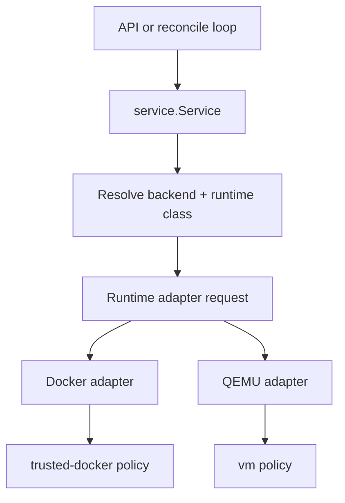

# Design

## Overview

The repo already has two real runtime implementations: `internal/runtime/docker` and `internal/runtime/qemu`. The smallest useful architectural fix is not to replace them, but to introduce a thin runtime-class and adapter layer above them.

That gives the system three things it does not currently express cleanly:
- whether a backend is trusted or production-isolating
- which policy gates apply to that backend
- how to add a future VM adapter without baking Docker CLI assumptions deeper into the service layer

This keeps the current Go `RuntimeManager` contract stable for callers while making the implementation less Docker-shaped internally.

## Affected areas

- `cmd/sandboxd/main.go`
  - resolve runtime backend and runtime class together during daemon startup
- `cmd/sandboxctl/doctor.go`
  - report runtime-class posture and production eligibility using the new metadata
- `internal/config/config.go`
  - add runtime-class validation and production fail-closed checks
- `internal/model/model.go`
  - persist runtime-class metadata on sandboxes and snapshots
- `internal/model/runtime.go`
  - extend runtime spec/state with additive runtime-class fields if needed
- `internal/service/service.go`
  - create sandboxes with resolved runtime-class metadata
- `internal/service/policy.go`
  - enforce production-only VM boundary from one place
- `internal/repository/store.go`
  - persist additive runtime-class metadata
- `internal/db/db.go`
  - add backward-compatible schema columns if runtime class is stored explicitly
- `internal/runtime/docker/runtime.go`
  - implement the adapter contract as `trusted-docker`
- `internal/runtime/qemu/runtime.go`
  - implement the adapter contract as the first VM-backed production class
- `docs/runtimes.md`
  - document trust posture and backend/class mapping
- `docs/operations/production-deployment.md`
  - update production guidance and operator expectations

## Control flow / architecture

The service and API surface should keep talking in terms of sandbox lifecycle. The new adapter layer should sit between service-level requests and backend-specific command execution.



### Runtime-class model

Use a minimal enum-like model rather than a large matrix.

Suggested shapes:

```go
type RuntimeClass string

const (
    RuntimeClassTrustedDocker RuntimeClass = "trusted-docker"
    RuntimeClassVM            RuntimeClass = "vm"
)
```

Mapping in the first wave:
- backend `docker` -> class `trusted-docker`
- backend `qemu` -> class `vm`

Future extension:
- backend `kata` or `containerd-kata` -> class `vm`

### Adapter contract

Keep the external `model.RuntimeManager` stable for now, but implement it through internal adapter requests that describe sandbox intent directly.

Suggested internal shapes:

```go
type SandboxAttachment struct {
    WorkspaceRoot string
    CacheRoot     string
    StorageRoot   string
    ReadOnlyRoot  bool
}

type NetworkAttachment struct {
    Mode model.NetworkMode
}

type AdapterCreateRequest struct {
    Spec        model.SandboxSpec
    Class       RuntimeClass
    Storage     SandboxAttachment
    Network     NetworkAttachment
}
```

This avoids introducing a second public lifecycle interface while still removing Docker CLI semantics from the center of the design.

### Production policy resolution

Config validation should resolve production posture in one place:
- development mode may use `trusted-docker` or `vm`
- production mode must resolve to `vm`
- doctor and runtime info endpoints should surface both backend and class

### Why not jump straight to containerd?

The user’s direction is correct for long-term Kata integration, but the repo does not currently use containerd, and the lightweight goal argues against making it mandatory in the first wave.

The adapter boundary should therefore be:
- small enough to support a future containerd/Kata adapter
- concrete enough to ship immediately using existing `docker` and `qemu` implementations

## Data and persistence

### SQLite changes

Use additive columns only if explicit persistence is needed.

Likely schema additions:
- `sandboxes.runtime_class TEXT NOT NULL DEFAULT ''`
- `snapshots.runtime_class TEXT NOT NULL DEFAULT ''`

Migration behavior:
- existing `docker` rows reconcile as `trusted-docker`
- existing `qemu` rows reconcile as `vm`
- empty values are interpreted through backend-to-class mapping during reads and reconciliation

### Config changes

Keep config changes minimal.

Options:
- keep `SANDBOX_RUNTIME` as the backend selector
- derive runtime class from backend internally
- optionally add `SANDBOX_TRUSTED_DOCKER_RUNTIME` deprecation handling so current local dev flows keep working

Avoid introducing a second required env var if derivation is sufficient.

### Session and memory implications

None. This work is isolated to runtime selection, policy, and persistence metadata.

## Interfaces and types

Possible additive model fields:

```go
type Sandbox struct {
    RuntimeBackend string
    RuntimeClass   RuntimeClass
}

type RuntimeInfo struct {
    Backend string `json:"backend"`
    Class   string `json:"class,omitempty"`
}
```

If the API should avoid a breaking change, keep `Backend` and add `Class` as optional.

## Failure modes and safeguards

- **invalid config**
  - fail startup when production resolves to a non-VM class
- **migration gaps**
  - treat empty runtime-class values as derived defaults from `runtime_backend`
- **reconcile drift**
  - log and mark a sandbox degraded if backend/class metadata is contradictory
- **future adapter sprawl**
  - keep the adapter surface minimal and lifecycle-focused
- **documentation drift**
  - doctor output and runtime info must use the same backend/class vocabulary as docs

## Testing strategy

- unit tests in `internal/config/config_test.go`
  - production must reject `docker`
  - development may allow both classes
- repository tests in `internal/repository/store_test.go`
  - additive runtime-class fields round-trip cleanly
- service tests in `internal/service/service_test.go`
  - create path persists derived runtime class
  - reconcile path tolerates legacy empty metadata
- API tests in `internal/api/integration_test.go`
  - runtime info and health report backend/class consistently
- runtime tests in `internal/runtime/docker/runtime_test.go` and `internal/runtime/qemu/runtime_test.go`
  - adapters report the expected class and satisfy the shared request model
