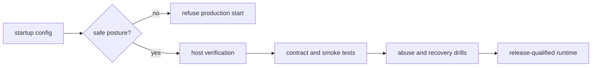

# Overview

This plan keeps `or3-sandbox` lightweight by proving the existing design instead of redesigning it. The implementation is mostly gating and verification work around the current daemon, runtime selection, tunnel model, and guest-agent/QEMU path.

The core idea is simple:

1. refuse unsafe production posture early,
2. make QEMU verification part of release discipline,
3. freeze the HTTP and streaming contract with conformance tests, and
4. prove that narrow capabilities and quotas still hold under abuse and restart.

# Affected areas

- `internal/config/*` — production/runtime validation and startup refusal for unsafe posture.
- `internal/runtime/qemu/*` — guest contract version checks, readiness/recovery verification, host-gated coverage.
- `internal/api/*` — stable error envelopes, tunnel revoke/inspect surfaces, contract and integration coverage.
- `internal/service/*` — quota enforcement behavior, runtime/tunnel inspection, restart reconciliation.
- `cmd/sandboxctl/*` — operator doctor, tunnel inspection/revoke, verification-friendly CLI flows.
- `docs/api-reference.md`, `docs/operations/*`, `scripts/*` — canonical contract, host verification, smoke, abuse, and recovery drills.

# Control flow / architecture

Runtime posture remains explicit:

- trusted and development use may run on Docker,
- hostile production use must run on QEMU with a verified guest contract.

Production flow:

1. Config validation checks runtime, auth mode, and required production secrets.
2. `sandboxctl doctor --production-qemu` and host-gated scripts validate the host and selected guest image contract.
3. API conformance tests lock down client-visible behavior for exec, streams, files, tunnels, snapshots, and lifecycle.
4. Abuse and recovery drills confirm quotas, restart reconciliation, and capability revocation remain conservative.

# Data and persistence

SQLite remains the source of truth for sandbox metadata, tunnel state, and lifecycle records.

Additive persistence only where needed:

- record or expose guest image contract version and guest-agent protocol version where not already surfaced,
- keep tunnel capability inspection backed by existing persisted launch/revoke state,
- do not add a second metadata store.

Config and env implications:

- production QEMU posture should require the current JWT and tunnel-signing configuration,
- shared tunnel-signing secret remains mandatory for replicated browser-facing deployments,
- no new runtime mode is needed.

# Interfaces and types

Keep the contract explicit and narrow.

Example conformance focus areas:

- `POST /v1/sandboxes/{id}/exec`
- `POST /v1/sandboxes/{id}/exec?stream=1` or equivalent documented streaming shape
- file upload/download endpoints
- tunnel create/inspect/revoke flow
- snapshot create/restore flow
- lifecycle actions and runtime inspection

The canonical shape continues to be the documented `snake_case` API plus current SSE/WebSocket framing rules.

# Failure modes and safeguards

- Unsafe production deployment: fail startup or doctor checks with clear action-oriented messages.
- Guest contract drift: fail host verification or release qualification when image metadata and runtime expectations diverge.
- Stream-format drift: conformance tests catch undocumented frame changes before release.
- Tunnel misuse: revoke capability, strip inbound auth material, and keep TTL/replay protection tested.
- Quota abuse: return stable errors or terminate work conservatively instead of hanging or overcommitting the host.
- Restart during activity: reconciliation must restore conservative state rather than claiming healthy capacity blindly.

# Testing strategy

- Unit tests for config posture validation, quota decision paths, and tunnel scope rules.
- API and integration tests for stable error envelopes, contract conformance, tunnel inspection/revoke, and header stripping.
- Host-gated QEMU tests and scripts for readiness, suspend/resume, snapshot restore, restart reconciliation, and guest contract validation.
- Abuse drills for resource pressure and noisy exec/tunnel behavior.
- Compatibility tests against the supported `or3-net` client path.
